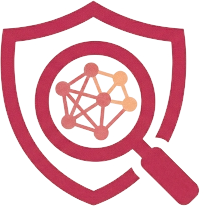
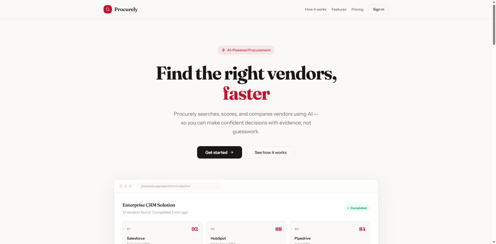
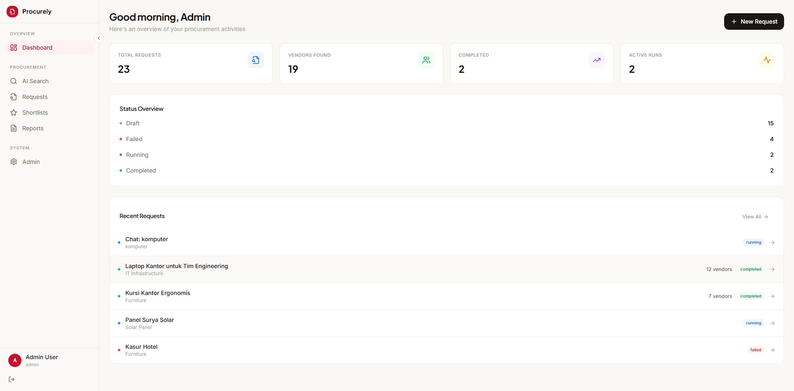
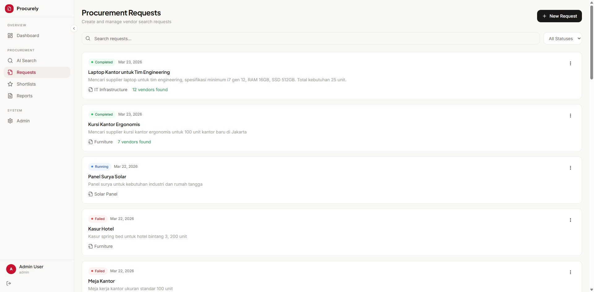
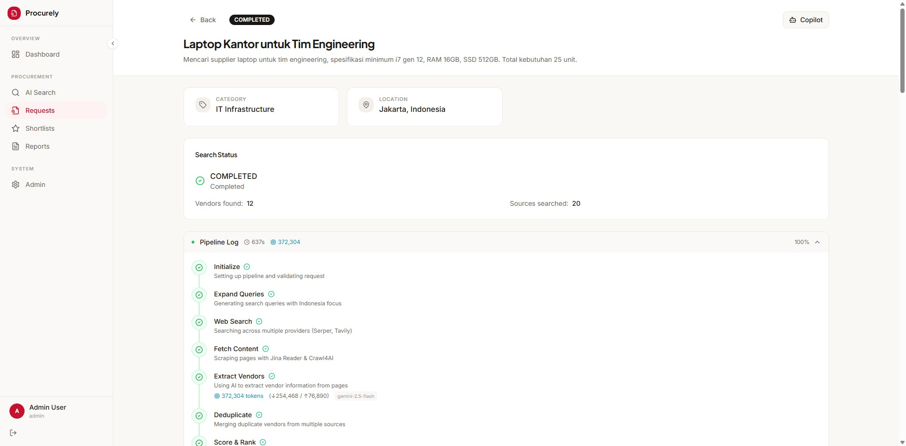
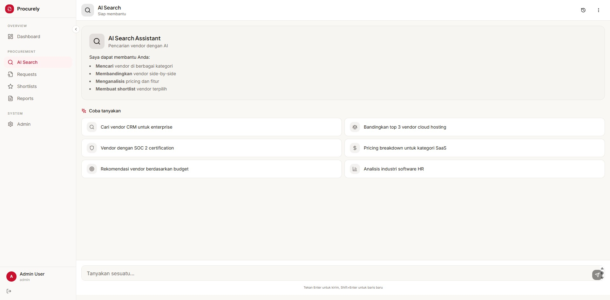
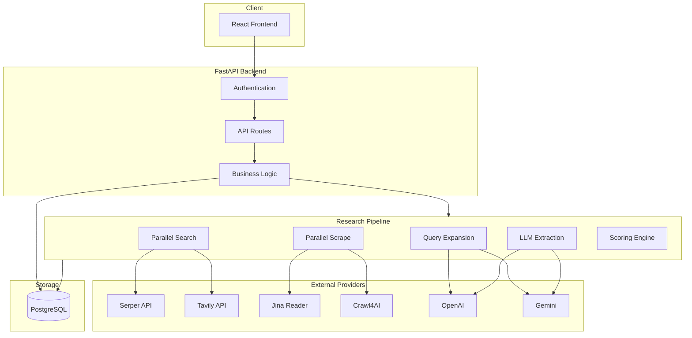
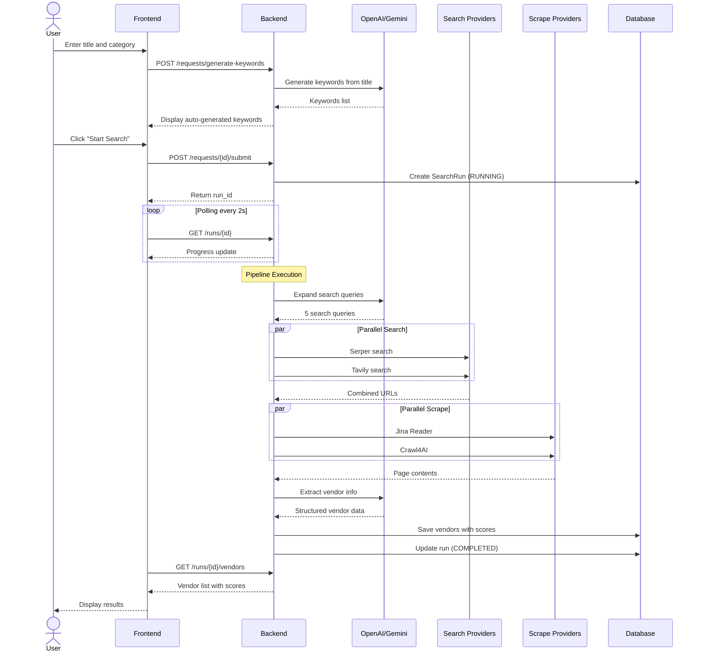
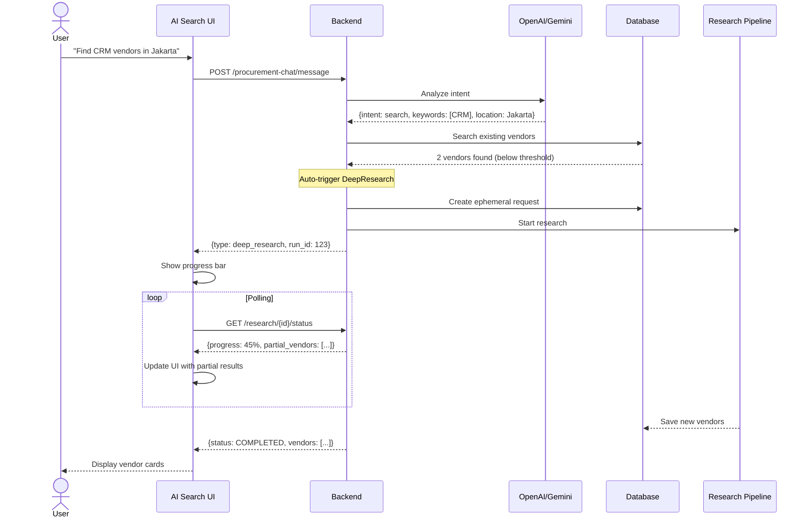
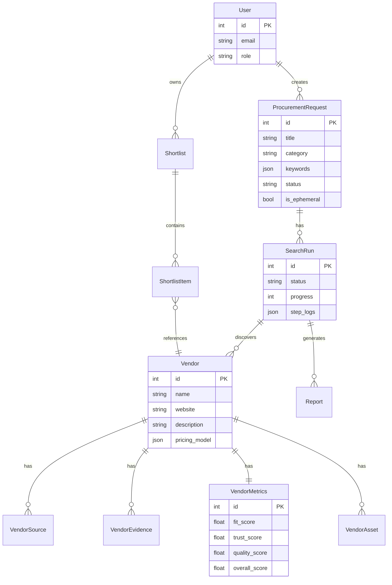

<p align="center">
  
</p>

<h1 align="center">Procurely</h1>

<p align="center">
  <strong>AI-Powered Vendor Discovery Platform for Procurement Teams</strong>
</p>

<p align="center">
  
</p>

<p align="center">
  <a href="#features">Features</a> •
  <a href="#architecture">Architecture</a> •
  <a href="#getting-started">Getting Started</a> •
  <a href="#screenshots">Screenshots</a> •
  <a href="#roadmap">Roadmap</a>
</p>

---

## Overview

Procurely is a full-stack procurement search copilot that automates vendor discovery, evaluation, and comparison. Instead of manually searching Google, visiting dozens of websites, and compiling spreadsheets, procurement teams can describe what they need and let the system do the research.

The platform combines multiple search engines, web scrapers, and LLMs to find vendors, extract structured information, and score them based on configurable criteria.

---

## Screenshots

### Landing Page


### Dashboard


### Procurement Requests


### Request Detail with Pipeline Log


### AI Search


---

## Features

### Vendor Discovery Pipeline

The core of Procurely is an automated research pipeline that executes when you submit a procurement request.

```
Request → Expand Queries → Search → Scrape → Extract → Deduplicate → Score → Logo
```

**What happens at each step:**

| Step | Description |
|------|-------------|
| **Expand** | LLM generates 5 search queries from your title and keywords |
| **Parallel Search** | Serper (Google) and Tavily run simultaneously |
| **Parallel Scrape** | Jina Reader and Crawl4AI fetch page content in parallel |
| **Extract** | LLM extracts vendor name, pricing, contact, certifications from raw content |
| **Deduplicate** | Merges vendors with >85% name similarity or same domain |
| **Score** | Calculates fit, trust, and quality scores |
| **Logo** | Fetches company logos from Clearbit and favicons |

### Multi-Provider Architecture

Unlike single-source solutions, Procurely runs multiple providers in parallel and aggregates results. Each provider returns different content for the same URL, giving the LLM richer data for extraction.

**Search Providers:**
- Serper (Google Search API)
- Tavily (AI-optimized search)

**Scrape Providers:**
- Jina Reader (clean markdown output, free)
- Crawl4AI (JavaScript rendering, self-hosted)
- httpx (fallback)

### AI Search Chat

A conversational interface for quick vendor lookups. The system searches your database first, then automatically triggers web research if results are insufficient.

**Auto-trigger conditions:**
- Less than 3 vendors found
- Average score below 50

The chat preserves context across messages, so follow-up questions like "show me only vendors in Jakarta" work without repeating the original query.

### DeepResearch Mode

For thorough research, the pipeline runs iterative gap analysis:

1. Initial discovery finds vendors
2. Gap analysis identifies missing information (pricing, certifications, contact)
3. Refined search queries target specific gaps
4. Process repeats up to 3 iterations

This mimics how a human researcher would dig deeper when initial results are incomplete.

### Vendor Scoring

Each vendor receives three scores:

| Score | Weight | Measures |
|-------|--------|----------|
| **Fit** | 35% | Match against must-have and nice-to-have criteria |
| **Trust** | 25% | Source quality, evidence count, company info completeness |
| **Quality** | 25% | Research completeness and extraction confidence |
| **Price** | 15% | Pricing competitiveness (when available) |

### Additional Features

- **Shortlists** - Save and organize vendors for comparison
- **HTML Reports** - Generate shareable procurement reports
- **Copilot** - Context-aware assistant for each request
- **Admin Panel** - Manage API keys and view audit logs
- **Rate Limiting** - 200 LLM requests/day global cap + per-IP limits
- **Security Headers** - X-Content-Type-Options, X-Frame-Options, HSTS, etc.

---

## Architecture

### Tech Stack

| Layer | Technology |
|-------|------------|
| Frontend | React 18, TypeScript, Vite, Tailwind CSS, React Query |
| Backend | FastAPI, Python 3.11+, SQLAlchemy 2.0, Alembic |
| Database | PostgreSQL (production) / SQLite (development) |
| AI | OpenAI GPT-4, Google Gemini |
| Search | Serper API, Tavily API |
| Scraping | Jina Reader, Crawl4AI |

### System Flow



### User Flow: Creating a Procurement Request



### User Flow: AI Search with Auto-Research



### Database Schema



---

## Getting Started

### Prerequisites

- Node.js 18+
- Python 3.11+
- PostgreSQL (or SQLite for development)

### Environment Variables

Copy `.env.example` to `backend/.env` and fill in your values:

```bash
cp .env.example backend/.env
# Edit backend/.env with your database URL, secrets, and admin credentials
```

API keys for search providers (OpenAI, Gemini, Serper, Tavily) can be configured via the Admin Panel after login.

### Installation

```bash
# Clone repository
git clone https://github.com/ABCDullahh/Procurely.git
cd Procurely

# Backend setup
cd backend
python -m venv venv
source venv/bin/activate  # Windows: venv\Scripts\activate
pip install -e .
alembic upgrade head
python -m app.scripts.seed_demo  # Optional: seed demo data
uvicorn app.main:app --reload --port 8000

# Frontend setup (new terminal)
cd frontend
npm install
npm run dev
```

### Credentials

Admin credentials are configured via environment variables in `backend/.env`:
- `DEFAULT_ADMIN_EMAIL` — admin email address
- `DEFAULT_ADMIN_PASSWORD` — admin password

See `.env.example` for the full list of environment variables.

---

## Project Structure

```
Procurely/
├── backend/
│   ├── app/
│   │   ├── api/v1/           # API routes
│   │   ├── models/           # SQLAlchemy models
│   │   ├── schemas/          # Pydantic schemas
│   │   ├── services/
│   │   │   ├── pipeline/     # Research pipeline
│   │   │   ├── providers/    # Search & scrape providers
│   │   │   └── llm/          # OpenAI & Gemini clients
│   │   └── core/             # Config, security, database
│   ├── alembic/              # Database migrations
│   └── tests/
│
├── frontend/
│   ├── src/
│   │   ├── components/       # React components
│   │   ├── pages/            # Route pages
│   │   ├── hooks/            # Custom hooks
│   │   └── lib/              # API clients & utilities
│   └── e2e/                  # Playwright tests
│
└── docker-compose.yml        # PostgreSQL + Crawl4AI
```

---

## Roadmap

### Completed

- [x] Multi-provider parallel search and scrape
- [x] LLM-powered vendor extraction
- [x] Vendor scoring with fit/trust/quality metrics
- [x] AI Search chat with auto web research
- [x] DeepResearch with iterative gap analysis
- [x] Shortlists and HTML reports
- [x] Admin panel for API key management
- [x] API rate limiting and usage quotas (200 LLM/day)
- [x] Security hardening (headers, CORS, strong credentials)

### In Progress

- [ ] Add vendor to shortlist directly from results table
- [ ] Bulk actions on vendor results
- [ ] Export to Excel/CSV

### Planned

- [ ] Email notifications for completed research
- [ ] Scheduled recurring searches
- [ ] Team collaboration features
- [ ] Vendor contact outreach integration
- [ ] Custom scoring criteria builder
- [ ] Webhook integrations
- [ ] Mobile responsive improvements

### Known Limitations

- Search is optimized for Indonesian market (locale: id_ID)
- Requires API keys for search providers (Serper/Tavily)
- LLM extraction accuracy depends on page content quality
- No real-time collaboration (single user per request)

---

## API Reference

### Core Endpoints

| Method | Endpoint | Description |
|--------|----------|-------------|
| POST | `/auth/login` | User authentication |
| GET | `/dashboard` | Dashboard statistics |
| POST | `/requests` | Create procurement request |
| POST | `/requests/{id}/submit` | Start research pipeline |
| GET | `/runs/{id}` | Get run status and progress |
| GET | `/runs/{id}/vendors` | Get discovered vendors |

### AI Search

| Method | Endpoint | Description |
|--------|----------|-------------|
| POST | `/procurement-chat/message` | Send chat message |
| GET | `/procurement-chat/research/{id}/status` | Poll research progress |
| POST | `/procurement-chat/research/{id}/cancel` | Cancel research |

### Admin

| Method | Endpoint | Description |
|--------|----------|-------------|
| GET | `/admin/api-keys` | List configured API keys |
| PUT | `/admin/api-keys/{provider}` | Set API key |
| GET | `/admin/audit-logs` | View audit trail |

---

## Contributing

Contributions are welcome. Please open an issue first to discuss what you would like to change.

1. Fork the repository
2. Create your feature branch (`git checkout -b feature/new-feature`)
3. Commit your changes (`git commit -m 'Add new feature'`)
4. Push to the branch (`git push origin feature/new-feature`)
5. Open a Pull Request

---

## License

This project is licensed under the MIT License. See [LICENSE](LICENSE) file for details.

---

<p align="center">
  Built for procurement teams who value their time.
</p>
